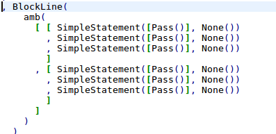
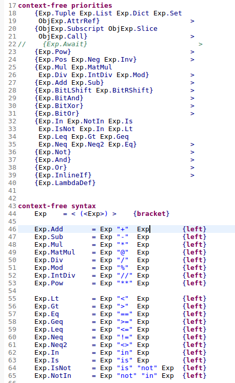

# Milestone 3

In the third milestone the focus was mainly on increasing the coverage of the language. It was expected that development on the Webassembly backend would be slow, therefore it was deemed very likely that the code analysis would achieve a higher coverage.
In the following sections our progress is explained for the three main areas of the code. 

## Syntax/Desugaring
It was not planned to spend a lot of time on the syntax and its desugaring. We would make some small fixes for known issues, but no addition of language constructs. 
It turned out that this was a false assumption and that we had to spend a lot of time on this again. The first thing that we needed to do was to add support for augmented assigns (+= -=), as this construct was simply forgotten.
Luckily this was not much work to integrate. 

A second thing that needed fixing were the else branches of the `if` and `while` statements. Making this fix was however not trivial as the root of the problem was not clear, all rules to parse them were present.
Around that same time Eduardo messaged Chiel to ask how far our implementation of the syntax was, as he might wanted to use it as part of a benchmark for a paper he is currently writing.
He identified a number of issues that could cause our problems. The main cause was that we excluded newlines from our layout. This was still an artifact of milestone 1 and 2 where we tried to get the layout-sensitive syntax to work.
With this change made, we fixed the problems we had. There was one downside however, as we introduced a lot of ambiguities with this new version. They were however hard to fix as it was not clear how they were ambiguous.
An example of this can be seen in the image below.

We were not able to fix the issues quickly, therefore we decided for a dirty solution that would work fine. We created an extra desugaring step to simply filter all the `amb()` constructs and replace them by the first element in their list of possibilities.
This worked fine, but became anoying quickly when writing the NaBL2 analysis. Due to the ambiguities the analysis result would still contain a giant warning showing the ambiguous AST, which cluttered the output.
To fix this it was decided to rewrite the entire syntax. It was already planned that we wanted to create a second syntax for Python, one the offical way and one using the SDF3 constructs. 
This would result in an interesting case study to see the difference between both implementations. Now we just had to to it earlier in the project. 

The new syntax was relatively easy to create, as we had a reference implementation in our old syntax definition. With the use of SDF3 constructs for priorities and associativity, the new syntax is way more readable and clean.
This is the clearest in the case of the syntax for expressions, for which the before and after can be seen in the images below. 

An effect of the new syntax was that we needed to update the desugaring in order to transform the new parse-AST to the Python AST.
This was not much work as the new syntax results in a cleaner AST that is more easily desugared. We also made small changes to the official AST format in the case of binary expressions. 
They are now of the form `BinOp(Op, LeftExp, RightExp)`. This not only makes desugaring more straightforward, but also simplifies the analysis and code generation.

With this syntax we already passed more tests than with the old syntax, but we also tested it with bigger source files. For this we used a Python file from one of Chiels projects (this file is included as a smoke-test in the examples package).
We were able to parse this file correctly, though some desugaring rules are still missing for other constructs that we did not support with the old syntax as well.

## Analysis

## Codegen
